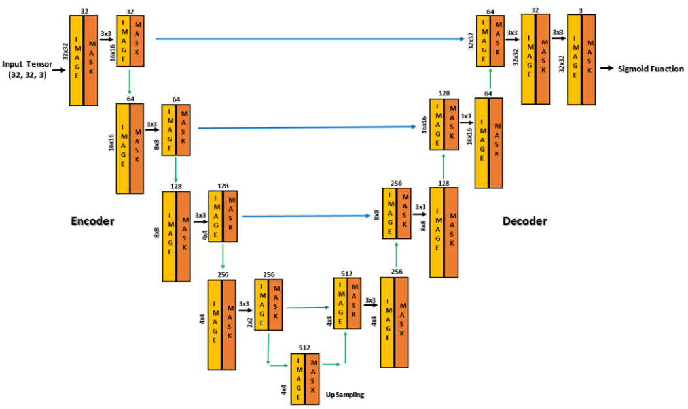
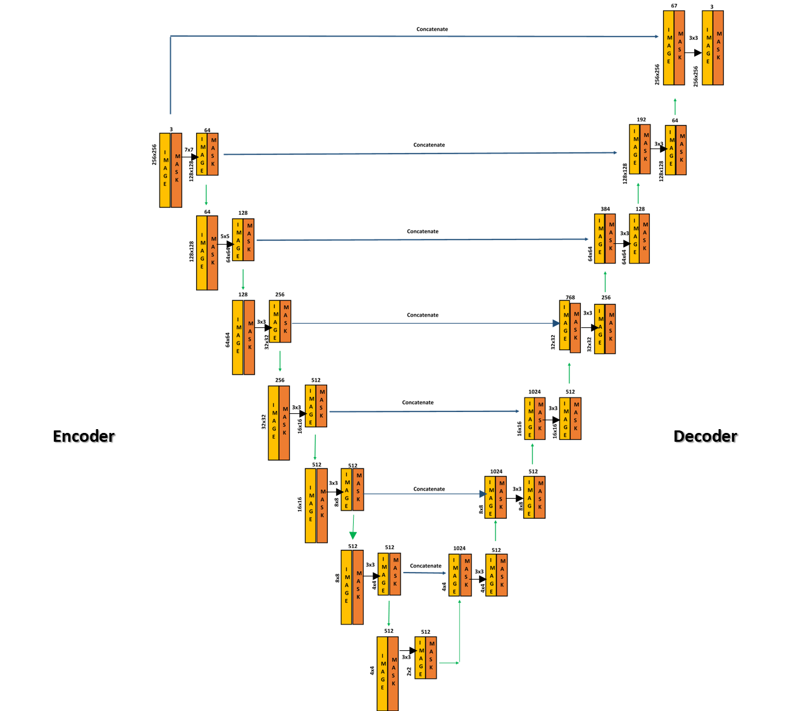

# Image Inpainting Using Deep Learning

Image Inpainting is the art of filling in damaged or missing pixels of an image. It is the process of reconstructing missing parts of an image so that observers are unable to tell that these regions have undergone restoration. The outcomes of this project converges onto to inpaint an image to recover any damage on it. Given an image, the algorithm proceeds to represent and manipulate it to obtain a corrected image which supposedly has lesser damage. This project is a recreation of the paper [Image Inpainting for Irregular Holes Using
Partial Convolutions](https://arxiv.org/abs/1804.07723) using [CIFAR-10
](https://www.cs.toronto.edu/~kriz/cifar.html) dataset and [Natural Images](https://www.kaggle.com/datasets/prasunroy/natural-images) dataset from Kaggle.

## Tools
1) Personal Computer (CPU)
2) Google Colaboratory (GPU)
a) Language - Python\
b) Framework - Pytorch

## Dataset
For the Partial Convolution Model we have used two datasets namely CIFAR 10 and Natural images Kaggle Dataset. 

a) **CIFAR-10**\
The CIFAR-10 dataset consists of 60000, 32x32 colour images in 10 classes, with 6000 images per class. There are 50000 training images and 10000 test images. The dataset is divided into five training batches and one test batch, each with 10000 images. The test batch contains exactly 1000 randomly-selected images from each class. The training batches contain the remaining images in random order, but some training batches may contain more images from one class than
another. Between them, the training batches contain exactly 5000 images from each class.

b) **Natural Images Kaggle Dataset**\
This dataset contains 6,899 images from 8 distinct classes compiled from various sources. The classes include airplane, car, cat, dog, flower, fruit, motorbike and person.

## Network Architecture

Two different Network Architectures were used for the two different datasets.

a) **CIFAR-10**

The CIFAR10 dataset consists of images having the dimension of 32x32, therefore the input images to the model will be having a tensor with dimensions of (32x32x3). The network is divided into two parts namely the encoder and the decoder. The encoder compresses the input data and converts the image to a latent space representation. The decoder reconstructs the data from the latent space representation. The essence of the encoder and decoder lies in the Upsampling part and the concatenate layer. ReLU is used in the encoding stage and LeakyReLU with alpha = 0.2 is used between all decoding layers. The kernel size used for the layers is 3. The channel sizes are 32, 64, 128, 256, 512. The last partial convolution layer’s input will contain the concatenation of the original input image with hole and original mask making it possible for the model to copy non-hole pixels.

b) **Natural Images Kaggle Dataset**

The Natural Images dataset consists of images having the dimension of 256x256, therefore the input images to the model will be having a tensor with dimensions of (256x256). It is a UNET - type architecture replacing all convolutional layers with partial convolutional layers and using nearest neighbour up-sampling in the decoding stage. The Architecture is similar to that used for the CIFAR10 dataset but there is an increased number of layers. ReLU is used in the encoding stage and LeakyReLU with alpha = 0.2 is used between all decoding layers. The kernel sizes used for the layers atr 7, 5 and 3. The channel sizes are 64, 128, 256, 512, 512, 512, 512. The last partial convolution layer’s input will contain the concatenation of the original input image with hole and original mask making it possible for the model to copy non-hole pixels.

## Flow Diagram

1) First an image is inserted, this image could be from the train, test data or from the
desktop.
2) Then the image is transformed into a tensor and also normalized using the torchvision
library.
3) Binary masking is performed. Here we use only random lines of various thickness to
mask the image.
4) We then obtain two images, the Masked image and the mask pattern
5) These two images are passed as arguments to the partial convolution model
6) The output is the inpainted image

## Evaluation and Results

a) **CIFAR-10**

The model was trained for 3 hours on the prepared dataset based on CIFAR10. The learning optimization algorithm used was ADAM with a learning rate of 0.01. The model was trained for 15 epochs. Jaccard Coefficient was used as the evaluation parameter to test the accuracy of the model.

b) **Natural Images Kaggle Dataset**

The model was trained for 6 hours on the prepared dataset based on Natural Images. The learning optimization algorithm used was ADAM with a learning rate of 0.01. The model was trained for 10 epochs. Dice Coefficient was used as the evaluation parameter to test the accuracy
of the model.

## Acknowledgements

 - [Image Inpainting for Irregular Holes Using Partial Convolutions](https://arxiv.org/abs/1804.07723)
 - [CIFAR-10](https://www.cs.toronto.edu/~kriz/cifar.html)
 - [Natural Images](https://www.kaggle.com/datasets/prasunroy/natural-images)
